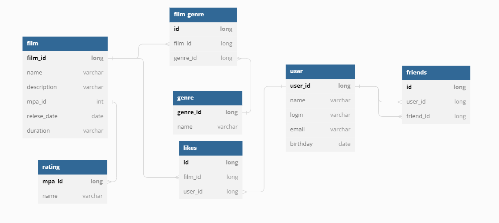

# java-filmorate
Template repository for Filmorate project.

Ссылка на ER-диаграмму: https://dbdiagram.io/d/646ccfa7dca9fb07c49d825b

Описание базы данных:

film

Содержит данные о фильмах.

первичный ключ film_id — идентификатор фильма;
name — название фильма;
description — описание фильма;
mpa_id — id рейтинга фильма;
release_date — дата релиза фильма;
duration — продолжительность фильма.

user

Содержит данные о пользователях.

первичный ключ user_id — идентификатор пользователя;
name — имя пользователя;
login — логин пользователя;
email — почта пользователя;
birthday — дата рождения пользователя;

rating

Содержит список рейтингов

первичный ключ mpa_id — идентификатор рейтинга фильма;
name - наименование рейтинга;

film_genre

Служит для связи двух таблиц film и genre. Позволяет осуществить связь многие ко многим

первичный ключ id
внешний ключ film_id — идентификатор фильма;
внешний ключ genre_id (ссылается на таблицу genre) — идентификатор жанра.

genre

Содержит перечень жанров.

первичный ключ mpa_id — идентификатор жанра;
name  — наименование жанра.

likes

Служит для связи двух таблиц film и user. Позволяет осуществить связь многие ко многим

первичный ключ id
внешний ключ film_id — идентификатор фильма;
внкшний ключ user_id (ссылается на таблицу user) — идентификатор пользователя.

friends

Содержит данные о дружбе между пользователями.

первичный ключ id
внешний ключ follower_user_id — идентификатор пользователя;
внешний ключ followed_user_id - идентификатор друга пользователя.